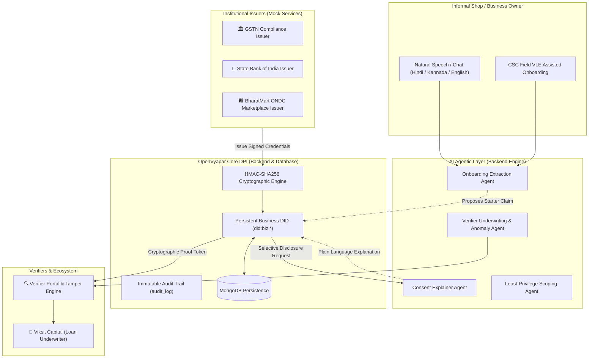

# OpenVyapar: Unified Business Identity

> **Reimagining Digital Public Infrastructure for India's 63+ Million MSMEs**  
> _Track: Reinvent Digital Public Infrastructure For Billions — Build for Billions Hackathon_

[](https://openvyapar-client.shaheem.in)
[](https://openvyapar.shaheem.in/docs)
[](https://www.typescriptlang.org/)
[](https://nodejs.org/)
[](https://react.dev/)
[](https://www.mongodb.com/)
[](https://opensource.org/licenses/MIT)

---

## 🌐 Live Deployments & Instant Preview

| Environment / Service                | Live URL                                                                         | Description                                                                                                           |
| ------------------------------------ | -------------------------------------------------------------------------------- | --------------------------------------------------------------------------------------------------------------------- |
| 💼 **Unified Frontend SPA**          | [**https://openvyapar-client.shaheem.in**](https://openvyapar-client.shaheem.in) | Production preview: Owner Wallet (`/`), Verifier Portal (`/verifier`), and Zero-Footprint Onboarding (`/onboarding`). |
| ⚡ **Live Backend API & AI Agents**  | [**https://openvyapar.shaheem.in**](https://openvyapar.shaheem.in)               | Express REST API, HMAC signing engine, Mock Issuers (GSTN, SBI, ONDC), and AI Agents (`/agent/*`).                    |
| 📚 **Interactive API Documentation** | [**https://openvyapar.shaheem.in/docs**](https://openvyapar.shaheem.in/docs)     | Complete Swagger/OpenAPI documentation and live interactive API explorer.                                             |

---

## Executive Summary

India's digital public infrastructure (DPI) revolution transformed individual identity with **Aadhaar**, payments with **UPI**, and personal documents with **DigiLocker**. However, **India's 63+ million micro, small, and medium enterprises (MSMEs)** remain trapped in a fragmented, person-centric document stack.

**OpenVyapar** introduces an **Entity-Centric Business Identity Layer (DPI for Businesses)**. Every enterprise receives a persistent decentralized identifier (`did:biz:*`) that decouples business reputation from any single individual. By combining **Verifiable Credentials**, **Selective-Disclosure Proofs**, **Scoped Delegation**, and a **Human-in-the-Loop Agentic Layer**, OpenVyapar enables informal and micro-enterprises to bootstrap verifiable trust, access credit without leaking confidential data, safely delegate tasks to CAs, and seamlessly transfer business history across generations.

---

## 🔍 The Problem: The MSME Trust & Identity Gap

| Challenge              | Existing Paradigm (DigiLocker / Manual)                                                                           | OpenVyapar Reimagined DPI                                                                                                  |
| ---------------------- | ----------------------------------------------------------------------------------------------------------------- | -------------------------------------------------------------------------------------------------------------------------- |
| **Identity Entity**    | **Person-Centric**: Documents are tied to an individual's Aadhaar/PAN. Business dies/resets if ownership changes. | **Business-Centric**: Persistent `did:biz:*` identity owned by the enterprise; accumulates historical credibility.         |
| **Verification**       | **Siloed & Repetitive**: GSTN, banks, and ONDC platforms re-verify identity and financial health from scratch.    | **Portable Institutional Trust**: Cryptographically signed verifiable credentials issued once, portable everywhere.        |
| **Data Privacy**       | **All-or-Nothing PDF Sharing**: Applying for a loan requires sharing full bank statements and invoice line-items. | **Selective Disclosure Proofs**: Prove revenue threshold or GST compliance without exposing customer lists or margins.     |
| **Task Delegation**    | **Dangerous Password Sharing**: Owners share OTPs and master portal credentials with CAs/accountants.             | **Scoped, Revocable Delegation**: Granular, time-bound tokens (`file_returns`, `view_orders`) with immutable audit trails. |
| **Informal Inclusion** | **Document Prerequisite**: Requires formal paperwork to even register on digital portals.                         | **Zero-Footprint Onboarding**: Voice/text AI extraction turns natural conversation into witnessed starter credentials.     |

---

## 💡 Key Architectural Pillars & Innovations

### 1. 🆔 Entity-Centric Business DID (`did:biz:*`)

Decouples the business identity from individual owners. Roles (`owner`, `former_owner`, `delegate`, `successor`) are mapped dynamically, ensuring that the business's accumulated credit score, compliance badges, and marketplace order history remain intact across ownership succession.

### 2. 📜 Verifiable Credential Aggregation (Mock Issuers)

Institutions issue cryptographically signed (HMAC-SHA256 canonicalized) credentials directly to the business DID:

- **🏛️ Mock GSTN Issuer**: Returns compliance score, active registration status, and filing regularity.
- **🏦 Mock State Bank of India Issuer**: Issues verified turnover bracket credentials (e.g., INR 25L–50L) without disclosing transaction logs.
- **🛍️ Mock BharatMart (ONDC) Issuer**: Issues completed order count and verified merchant rating badges.
- **🤝 Self-Attested & CSC-Witnessed Starter Credential**: Bootstraps trust for informal businesses with zero digital footprint.

### 3. 🛡️ Selective Disclosure & Tamper-Evident Proofs

Business owners can selectively assemble claims for specific verifiers (e.g. lenders, supply chain platforms) with purpose-bound claims:

- Cryptographic proof hashes ensure instant **HMAC signature verification**.
- Built-in **Simulate Tampering** engine demonstrates immediate signature rejection if payload contents are altered.

### 4. 🔑 Scoped, Revocable Delegation Engine

Replaces risky password sharing with cryptographic delegation tokens:

- Scopes are restricted to least privilege (e.g., `file_returns`, `view_compliance`, `view_orders`).
- Bank account access and loan permissions are automatically protected.
- Instant, 1-click token revocation with an immutable audit log.

### 5. 🤖 Human-in-the-Loop Agentic Layer (_"Agents Propose, Humans Confirm"_)

Non-technical, multilingual business owners interact with intelligent agents that simplify complex DPI primitives:

- **🗣️ Onboarding Extraction Agent**: Parses unstructured vernacular conversations (Hindi, Kannada, English) into structured business identity schemas.
- **💬 Consent Explainer Agent**: Contrasts exactly what data is being shared vs. what remains protected in plain, low-literacy-friendly terms.
- **🎯 Scoping Agent**: Translates natural language requests (_"Let my CA file taxes"_) into minimal granular permission scopes.
- **🔍 Verifier Anomaly Agent**: Highlights operational continuity, tenure, and anomalies for underwriting officers.

> 🔒 **Core Guardrail (PRD §8 & §12)**: AI agents **NEVER** autonomously mutate business state. Agents write proposals to `agent_action` with `human_decision: "pending"`. A state mutation occurs only after an explicit human confirmation, logged in `audit_log`.

---

## 🏛️ System Architecture & Data Flow



---

## 🖥️ The 3 Unified Portals

Experience the application live at [https://openvyapar-client.shaheem.in](https://openvyapar-client.shaheem.in) or locally at `http://localhost:5173`:

1. **💼 [Owner Wallet Dashboard](https://openvyapar-client.shaheem.in/) (`/`)**:
   - Manage credentials with issuer badges and HMAC cryptographic status.
   - Run **Time-Skip Batch Issuance** to simulate institutional credential accumulation.
   - Generate selective disclosure proofs with plain-language AI consent breakdowns.
   - Scoped delegation management with natural language scope proposals and 1-click revocation.
   - Multi-language switcher (**हिन्दी**, **ಕನ್ನಡ**, **English**).

2. **🔍 [Verifier & Underwriting Portal](https://openvyapar-client.shaheem.in/verifier) (`/verifier`)**:
   - Inspect cryptographic proofs shared via URL or QR code.
   - Real-time cryptographic validity indicator (**VALID** vs **TAMPERED**).
   - **Simulate Tampering** toggle: Modifies verified turnover live to demonstrate instant cryptographic signature failure.
   - AI Trust Summary & anomaly detection flags for loan officers.

3. **🎙️ [Zero-Footprint Onboarding UI](https://openvyapar-client.shaheem.in/onboarding) (`/onboarding`)**:
   - Conversational voice/text interface for informal shopkeepers.
   - One-click sample transcripts (Hindi Kirana Shop, Hindi Chai Stall, English Handloom).
   - Live structured metadata preview and starter `self_attested` credential generation witnessed by CSC VLE.

---

## 🎬 5-Beat Demo Walkthrough

Follow the guided demo script in [`demo/script.md`](file:///home/shamblonaut/dev/openvyapar/demo/script.md):

| Beat       | Narrative & Persona                                                                     | Key Action                                                                                                   | Live Demo Link                                                    | DPI Takeaway                                                                                      |
| ---------- | --------------------------------------------------------------------------------------- | ------------------------------------------------------------------------------------------------------------ | ----------------------------------------------------------------- | ------------------------------------------------------------------------------------------------- |
| **Beat 1** | **Zero-Footprint Onboarding**<br>_Ramesh Sharma (Shop Owner) & Aarav (CSC VLE)_         | Open Onboarding → Pick Hindi Kirana transcript → AI extracts claims → Confirm & Register.                    | [Try Onboarding](https://openvyapar-client.shaheem.in/onboarding) | Bootstraps formal verifiable identity from unstructured voice with no prior documents.            |
| **Beat 2** | **Institutional History Accumulation**<br>_Ramesh Sharma (Owner)_                       | Open Wallet → Click **Time-Skip (Issue Batch)** → Receive GSTN, SBI, and BharatMart credentials.             | [Open Wallet](https://openvyapar-client.shaheem.in/)              | Business identity accumulates portable reputational capital from multiple institutions over time. |
| **Beat 3** | **Selective Disclosure & Loan Underwriting**<br>_Ramesh Sharma & Viksit Capital Lender_ | Select GST & Marketplace claims → Click **Explain Consent** → Open Verifier → Toggle **Simulate Tampering**. | [Try Verifier](https://openvyapar-client.shaheem.in/verifier)     | Data minimization (no bank statements leaked) + mathematical tamper detection.                    |
| **Beat 4** | **Scoped CA Delegation**<br>_Ramesh Sharma & CA Vikas Mehta_                            | Input: _"I want CA Vikas to file my taxes"_ → AI proposes `['file_returns']` → Confirm & Revoke.             | [Open Delegation](https://openvyapar-client.shaheem.in/)          | Granular least-privilege delegation without password sharing, backed by audit log.                |
| **Beat 5** | **Multilingual Support & Succession**<br>_Ramesh Sharma $\rightarrow$ Priya Sharma_     | Switch UI to **हिन्दी** / **ಕನ್ನಡ** → Transfer business ownership to daughter Priya Sharma.                  | [Try Multilingual](https://openvyapar-client.shaheem.in/)         | Linguistic inclusivity + business identity and reputation survive ownership transitions.          |

---

## 📁 Repository & Monorepo Structure

```
openvyapar/
├── shared/                   # Single source of truth TypeScript types, DTOs & fixtures
│   ├── src/types/            # Business, Credential, Delegation, Proof, and Audit schemas
│   └── src/fixtures/         # Baseline seed records & demo data
├── backend/                  # Express REST API, MongoDB Mongoose, AI Engine & Crypto
│   ├── src/agents/           # Onboarding, Consent, Scoping, and Verifier AI Agents
│   ├── src/db/               # Mongoose models, connection, and seeder scripts
│   ├── src/issuers/          # Mock GSTN, SBI Bank, and ONDC marketplace credential issuers
│   ├── src/routes/           # Business, Credential, Delegation, Proof, Agent, Admin routes
│   └── src/utils/crypto.ts   # HMAC-SHA256 canonicalization and signing engine
├── frontend/                 # Unified React 19 SPA (Vite + Tailwind CSS + Lucide)
│   ├── src/pages/            # WalletDashboard, VerifierPortal, OnboardingPortal
│   ├── src/components/       # CredentialCard, ProofBuilder, DelegationPanel, ConsentModal
│   ├── src/i18n/             # Multilingual dictionary (Hindi, Kannada, English)
│   └── src/api/              # Typed backend API client
├── demo/                     # Demo simulation scripts & presentation narrative
│   ├── script.md             # 5-Beat presentation script for hackathon judges
│   ├── run-demo-flow.mjs     # End-to-end automated CLI demo runner
│   └── seed-demo.js          # Standalone baseline database seeder
├── docker-compose.yml        # Full-stack container orchestration
├── Dockerfile                # Multi-stage production container build
├── PRD.md                    # Core Product Requirements Document & Schema Reference
└── AGENTS.md                 # Agent guidelines, invariants & repo rulebook
```

---

## 🚀 Quickstart & Setup Guide

### Prerequisites

- **Node.js**: v20.0.0 or higher (v22+ recommended)
- **npm**: v10.0.0 or higher
- **MongoDB**: Local MongoDB instance running on `mongodb://localhost:27017/openvyapar` (or use Docker Compose)

---

### Method A: Local Development Setup

#### 1. Install Dependencies & Build Workspaces

```bash
# Clone the repository
git clone https://github.com/your-org/openvyapar.git
cd openvyapar

# Install root and workspace dependencies
npm install

# Build shared types, backend, and frontend
npm run build
```

#### 2. Run Test Suites & Demo Flow

```bash
# Run all unit and integration tests across workspaces
npm run test

# Run the automated 5-Beat end-to-end simulation runner
npm run test:demo
```

#### 3. Seed Database & Start Development Servers

```bash
# Seed initial baseline demo data into MongoDB
npm run seed

# Start both Backend (Port 3000) and Frontend (Port 5173) concurrently
npm run dev
```

| Service                     | Local URL                                                  | Live Deployed Preview                                                        |
| --------------------------- | ---------------------------------------------------------- | ---------------------------------------------------------------------------- |
| **Unified Frontend App**    | [`http://localhost:5173`](http://localhost:5173)           | [https://openvyapar-client.shaheem.in](https://openvyapar-client.shaheem.in) |
| **Backend API & AI Agents** | [`http://localhost:3000`](http://localhost:3000)           | [https://openvyapar.shaheem.in](https://openvyapar.shaheem.in)               |
| **Interactive API Docs**    | [`http://localhost:3000/docs`](http://localhost:3000/docs) | [https://openvyapar.shaheem.in/docs](https://openvyapar.shaheem.in/docs)     |

---

### Method B: 🐳 Docker Compose (1-Command Full Stack)

To run Frontend, Backend, and isolated MongoDB in Docker containers:

```bash
# Build and start all services in detached mode
npm run docker:up

# Seed demo fixtures into the containerized MongoDB
npm run docker:seed

# View live aggregate logs
npm run docker:logs

# Stop services
npm run docker:down
```

---

## 🛠️ Admin & State Management API

OpenVyapar provides built-in admin endpoints for rapid judge testing, state resets, and snapshots (works against both local and live deployments):

- **Reset to Baseline Demo State**:

  ```bash
  # Local:
  curl -X POST http://localhost:3000/admin/reset

  # Live:
  curl -X POST https://openvyapar.shaheem.in/admin/reset
  ```

- **Reset to Clean/Empty Database**:
  ```bash
  curl -X POST "https://openvyapar.shaheem.in/admin/reset?empty=true"
  ```
- **Save Checkpoint Snapshot**:
  ```bash
  curl -X POST https://openvyapar.shaheem.in/admin/snapshot \
    -H "Content-Type: application/json" \
    -d '{"name": "pre-loan-checkpoint"}'
  ```
- **Restore Checkpoint Snapshot**:
  ```bash
  curl -X POST https://openvyapar.shaheem.in/admin/restore \
    -H "Content-Type: application/json" \
    -d '{"name": "pre-loan-checkpoint"}'
  ```

---

## 🛡️ Security, Cryptographic Integrity & DPDP Compliance

1. **HMAC-SHA256 Payload Signing**: Every credential and proof token carries a canonicalized HMAC signature. Changing even a single digit in turnover or order counts immediately invalidates the proof.
2. **DPDP Act (Digital Personal Data Protection) Alignment**:
   - **Purpose Limitation**: Proof tokens are issued for explicit purposes (`loan_application`, `platform_onboarding`).
   - **Data Minimization**: Selective disclosure guarantees zero unnecessary data leakage.
   - **Informed Consent**: Agent explainer breaks down complex consent clauses into colloquial, understandable terms.
   - **Right to Revoke**: Delegation tokens can be severed in real time.

---

## 🗺️ Future Roadmap

- **Federated State Registry Protocol**: Standardized API contract allowing state-level commercial tax and licensing bodies to issue OpenVyapar-compliant credentials.
- **W3C DID & Verifiable Credentials 2.0**: Transition from HMAC to Ed25519/BBS+ signature suites with Zero-Knowledge Proofs (ZKPs).
- **ONDC & Account Aggregator (AA) Native Integration**: Direct plugin for ONDC buyer/seller apps and RBI-regulated Account Aggregators.
- **Offline Proof Verification**: Bluetooth BLE / QR air-gapped verification for rural and connectivity-challenged areas.

---

## 📜 License

This project is licensed under the **MIT License** — see the [LICENSE](file:///home/shamblonaut/dev/openvyapar/LICENSE) file for details.
