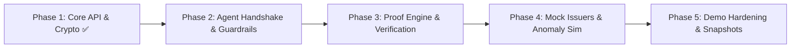

# 🛠️ OpenVyapar Backend Roadmap & Engineering Plan (`backend/PLAN.md`)

> **Service:** `@openvyapar/backend`  
> **Default Port:** `3001`  
> **Runtime:** Node.js 24 (Native ESM), TypeScript 5.8+  
> **Single Source of Truth:** [`PRD.md`](file:///home/shamblonaut/dev/openvyapar/PRD.md) & [`AGENTS.md`](file:///home/shamblonaut/dev/openvyapar/AGENTS.md)

---

## 📌 1. Current State & Baseline (Phase 1: Completed ✅)

The core data persistence, HMAC cryptography, and baseline REST endpoints are fully implemented and verified with automated test suites:

- [x] **File-backed Persistence Layer** ([`backend/src/db/connection.ts`](file:///home/shamblonaut/dev/openvyapar/backend/src/db/connection.ts)): In-memory cache + atomic JSON disk sync to `backend/data/openvyapar_db.json`.
- [x] **Relational DDL Reference** ([`backend/src/db/schema.sql`](file:///home/shamblonaut/dev/openvyapar/backend/src/db/schema.sql)): PRD §7 compliant SQL schema with primary & foreign key constraints.
- [x] **HMAC-SHA256 Signing & Verification** ([`backend/src/utils/crypto.ts`](file:///home/shamblonaut/dev/openvyapar/backend/src/utils/crypto.ts)): Deterministic canonical claim serialization, secret-keyed signatures, and tamper detection.
- [x] **Core REST APIs**:
  - `POST /business`, `GET /business/:id`, `POST /business/:id/roles` ([`backend/src/routes/business.ts`](file:///home/shamblonaut/dev/openvyapar/backend/src/routes/business.ts))
  - `POST /credentials/issue`, `GET /credentials/:business_id` ([`backend/src/routes/credentials.ts`](file:///home/shamblonaut/dev/openvyapar/backend/src/routes/credentials.ts))
  - `POST /delegation/grant`, `POST /delegation/revoke`, `GET /delegation/:business_id` ([`backend/src/routes/delegation.ts`](file:///home/shamblonaut/dev/openvyapar/backend/src/routes/delegation.ts))
  - `POST /proof/generate`, `GET /proof/verify/:proof_id` ([`backend/src/routes/proof.ts`](file:///home/shamblonaut/dev/openvyapar/backend/src/routes/proof.ts))
  - `POST /mocks/issue-batch/:business_id` ([`backend/src/routes/mocks.ts`](file:///home/shamblonaut/dev/openvyapar/backend/src/routes/mocks.ts))
  - `GET /audit/:business_id`, `POST /audit/agent-action` ([`backend/src/routes/audit.ts`](file:///home/shamblonaut/dev/openvyapar/backend/src/routes/audit.ts))
- [x] **Integration Test Suite** ([`backend/test/api.test.ts`](file:///home/shamblonaut/dev/openvyapar/backend/test/api.test.ts)): 9/9 passing tests validating all endpoints and cryptographic checks.

---

## 🎯 2. Engineering Roadmap (Remaining Phases)



---

### 🛡️ Phase 2: Agent-Service Handshake & Guardrail Tightening
**Goal:** Guarantee complete adherence to PRD §8 and §12 Human-in-the-Loop constraints.

#### Tasks:
1. [x] **Agent Proposal Lifecycle Enforcement**:
   - Validate that when `agent_action_id` is passed to mutation routes (`/business`, `/proof/generate`, `/delegation/grant`), the referenced `agent_action` is updated from `pending` $\rightarrow$ `confirmed` atomically.
   - Prevent executing the same proposal twice (idempotency protection).
2. **Audit Trail Enrichment**:
   - Include IP/origin, actor role, and diff metadata in audit records.
   - Expose endpoint `GET /audit/:business_id/timeline` to deliver formatted chronologies directly to the frontend audit visualizer.
3. **Multi-persona Auth Context Support**:
   - Provide lightweight header/query authentication simulation (e.g. `x-openvyapar-actor-id: did:person:ramesh001`) to auto-populate `actor_id` and role validations.

---

### 🔍 Phase 3: Selective-Disclosure Proof Engine & Verification Enhancements
**Goal:** Deliver verifier experiences for lending, GST inspection, and vendor onboarding.

#### Tasks:
1. **Proof Expiration & Single-Use Tokens**:
   - Support `expires_at` and `max_uses` fields on proof shares.
   - When a verifier accesses an expired proof, return explicit verification reason `PROOF_EXPIRED`.
2. **Granular Attribute Redaction**:
   - Allow claims to disclose partial fields (e.g., disclosing `turnover_bracket` while redacting exact account balance).
   - Compute Merkle / HMAC sub-hashes for individual claim fields.
3. **Interactive Tamper Testing API**:
   - Add utility route `POST /proof/simulate-tamper/:proof_id` for judges/demoers to corrupt signature bytes on the fly and witness real-time verifier alerts.

---

### 🏛️ Phase 4: Mock Issuers & Dynamic Scenario Simulation
**Goal:** Allow live demonstration of diverse business profiles and anomaly flagging.

#### Tasks:
1. **Dynamic Mock Configuration**:
   - Extend `POST /mocks/issue-batch/:business_id` with profile templates:
     - `standard_healthy`: 100% compliance, high orders, tier 1 balance.
     - `gst_defaulter`: Missed returns, active compliance score 42.
     - `high_growth_merchant`: >5,000 orders on ONDC, 4.9 rating.
2. **CSC Agent Witnessing Flow**:
   - Implement `POST /mocks/csc-witness` to simulate physical geolocation tag and CSC photo verification claim generation for Beat 1 zero-footprint onboarding.

---

### ⚡ Phase 5: Demo Hardening & State Management
**Goal:** Ensure 0s reset latency and zero-friction presentation during hackathon evaluations.

#### Tasks:
1. **Instant Snapshot & Restore**:
   - Add `POST /admin/reset` and `POST /admin/snapshot` endpoints for 1-click database resets from the frontend demo bar.
2. **CORS & Multi-Port Environment Hardening**:
   - Ensure permissive yet structured CORS handling for ports `5173` (Wallet), `5174` (Verifier), and `5175` (Onboarding).
3. **End-to-End Health & Readiness Probes**:
   - Enhance `GET /health` to report DB record counts, memory usage, and mock issuer status.

---

## 📋 3. REST API Contract Quick Reference

| Method | Route | Description | Human Guardrail Required |
|---|---|---|:---:|
| `GET` | `/health` | Service health and subsystem status | No |
| `POST` | `/business` | Create new business DID & owner role | Yes (`agent_action_id`) |
| `GET` | `/business` | List registered businesses | No |
| `GET` | `/business/:id` | Get business profile and active roles | No |
| `POST` | `/business/:id/roles`| Assign or transfer role (e.g. Beat 5 succession) | Yes |
| `GET` | `/business/:id/roles`| Get role holders with hydrated person profiles | No |
| `POST` | `/credentials/issue` | Issue HMAC-signed credential | Yes |
| `GET` | `/credentials/:business_id` | List credentials with real-time signature checks | No |
| `POST` | `/delegation/grant` | Issue scoped delegation token to delegate | Yes (`agent_action_id`) |
| `POST` | `/delegation/revoke`| Revoke active delegation token immediately | Yes |
| `GET` | `/delegation/:business_id` | List all tokens with hydrated delegate info | No |
| `POST` | `/proof/generate` | Generate selective-disclosure proof token | Yes (`agent_action_id`) |
| `GET` | `/proof/verify/:proof_id` | Verifier inspection & HMAC validation | No |
| `POST` | `/mocks/issue-batch/:business_id` | Beat 2 batch issuance (GST, Bank, Marketplace) | No (Simulation) |
| `GET` | `/audit/:business_id` | Fetch immutable audit trail & agent proposals | No |
| `POST` | `/audit/agent-action` | Record agent proposal (`pending` state) | No (Proposal only) |

---

## 🧪 4. Testing & Verification Checklist

- [x] Run shared types verification: `npm --workspace=shared run test`
- [x] Run backend integration test suite: `npm --workspace=backend run test`
- [x] Run multi-service demo narrative: `npm run test:demo`
- [ ] Add unit tests for partial claim disclosure & redaction
- [ ] Add unit tests for idempotency on confirmed agent proposals
- [ ] Add test for `POST /admin/reset` state reload

---

## 🚀 5. Getting Started on Next Tasks

To work on Phase 2 & 3 tasks:
```bash
# Start backend in auto-reloading watch mode
npm --workspace=backend run dev

# Run test suite on file change
npm --workspace=backend run test
```
